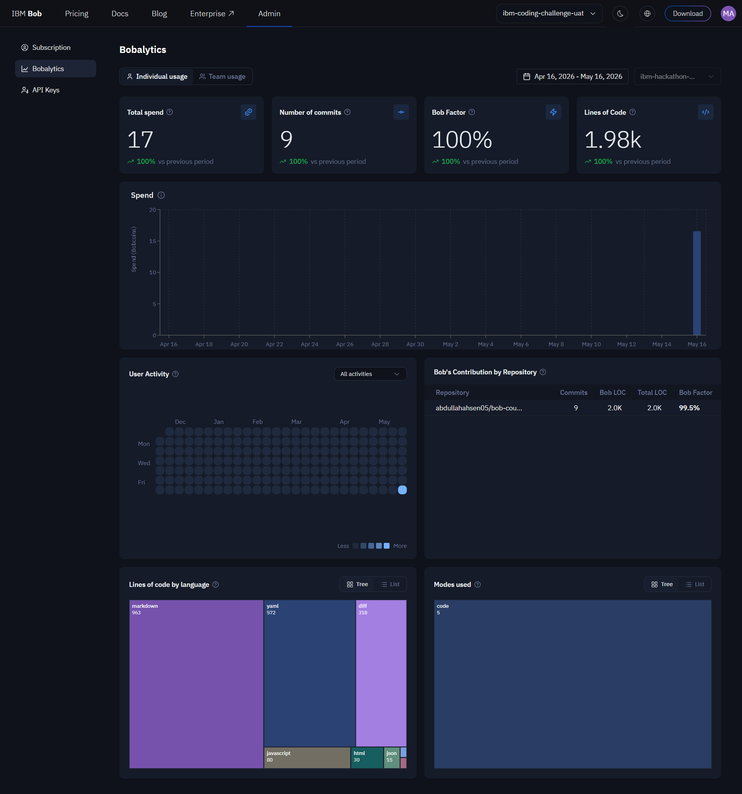

# 🎭 Bob Council

**Multi-persona AI code review powered by IBM Bob**

A demonstration of IBM Bob's Orchestrator mode coordinating 7 custom AI personas to conduct comprehensive PR reviews, then presenting findings through an interactive narrated walkthrough.

> **📝 Build Documentation:** See [docs/how-we-used-bob.md](docs/how-we-used-bob.md) for the session-by-session build log, and [Exported BOB TASK sessions/](Exported%20BOB%20TASK%20sessions/) for complete raw Bob task transcripts showing every interaction.

---

## 🎯 What is Bob Council?

Bob Council simulates a diverse code review panel where each AI persona brings domain expertise:

- 🔒 **Security Auditor** - Identifies vulnerabilities (SQL injection, XSS, auth bypasses)
- ⚡ **Performance Engineer** - Flags N+1 queries, memory leaks, algorithmic inefficiencies
- ♿ **Accessibility Inspector** - Ensures WCAG compliance, semantic HTML, ARIA usage
- 💰 **Cost-of-Ownership Engineer** - Evaluates observability, error handling, maintainability
- 🤔 **Skeptical Junior** - Questions confusing patterns from a newcomer's perspective

After individual reviews, a **Synthesizer** mediates disagreements and produces a final verdict (BLOCK/SHIP/DISCUSS), and a **Director** generates a narrated walkthrough script highlighting key issues in the code.

---

## 🚀 Live Demo

**[View the interactive viewer →](https://abdullahahsen05.github.io/bob-council/viewer/)**

Try the narrated walkthroughs:
- **PR #1: Auth Bug** - SQL injection, plaintext passwords, hardcoded secrets
- **PR #2: Performance Regression** - Full table scan, N+1 queries, missing auth

---

## 🏗️ Architecture

```
┌─────────────────────────────────────────────────────────────┐
│  IBM Bob Orchestrator Mode                                  │
│  (Coordinates subtasks via new_task delegation)             │
└────────────┬────────────────────────────────────────────────┘
             │
             ├──► 🔒 Security Auditor (custom mode)
             ├──► ⚡ Performance Engineer (custom mode)
             ├──► ♿ Accessibility Inspector (custom mode)
             ├──► 💰 Cost-of-Ownership Engineer (custom mode)
             ├──► 🤔 Skeptical Junior (custom mode)
             │
             ├──► 🧩 Synthesizer (custom mode)
             │    └─► Produces verdict.md (vote tally, mediation, final recommendation)
             │
             └──► 🎬 Director (custom mode)
                  └─► Produces script.json (narrated walkthrough scenes)
```

**Key insight:** Bob's Orchestrator has no direct tool access—it's a pure coordinator. Each subtask runs in its target custom mode with that mode's own tool permissions. We verified this end-to-end across 3 PRs without manual intervention.

---

## 📂 Repository Structure

```
bob-council/
├── .bob/
│   ├── custom_modes.yaml          # 7 custom mode definitions
│   └── rules-orchestrator/
│       └── 01-council.md          # Auto-loads council playbook
├── orchestrator/
│   └── council-playbook.md        # Step-by-step orchestration instructions
├── samples/
│   ├── pr-1-auth-bug/
│   │   ├── meta.json              # PR metadata
│   │   ├── pr.diff                # Git diff
│   │   ├── verdict.md             # Council's final verdict
│   │   └── before/                # Pre-change code
│   └── pr-2-perf-regression/
│       └── ...
├── viewer/
│   ├── index.html                 # Landing page + walkthrough player
│   ├── report.html                # Full council report (renders verdict.md)
│   ├── viewer.js                  # Player logic (TTS narration, scene rendering)
│   ├── viewer.css                 # Dark theme styling
│   └── samples/
│       ├── pr-1-auth-bug/
│       │   └── script.json        # Narrated walkthrough scenes
│       └── pr-2-perf-regression/
│           └── script.json
└── docs/
    ├── architecture.md            # System design
    ├── modes-spec.md              # Custom mode specifications
    └── how-we-used-bob.md         # Session-by-session build log
```

---

## 🎬 Features

### Interactive Walkthrough Player
- **Narrated code review** - Text-to-speech reads each scene's narration
- **Synchronized highlighting** - Code and annotations update together
- **Scene navigation** - Play/pause, previous/next controls
- **Suggested fixes** - Actionable recommendations for each issue
- **Progress tracking** - Visual progress bar and scene counter

### Council Report
- **Markdown-rendered verdict** - Clean, readable format from verdict.md
- **Severity pills** - Color-coded CRITICAL/MAJOR/MINOR tags
- **Vote tally** - Shows 👍/👎/🤔 breakdown with contentiousness score
- **Mediation notes** - Explains where council agreed/split
- **Print-friendly** - Export to PDF with preserved styling

### Custom Modes
Each reviewer mode has:
- **Domain expertise** - Specialized knowledge (security, performance, a11y, cost, junior perspective)
- **Severity classification** - CRITICAL/MAJOR/MINOR issue tagging
- **Confidence scoring** - HIGH/MEDIUM/LOW confidence in findings
- **Vote casting** - 👍 SHIP / 👎 BLOCK / 🤔 DISCUSS with reasoning

---

## 🛠️ How It Works

### 1. Orchestrator Receives PR
```yaml
Input:
  - PR diff (git diff)
  - Before code (full file context)
  - PR metadata (title, description)
```

### 2. Parallel Review Phase
Orchestrator delegates to 5 reviewer modes simultaneously via `new_task()`:
```javascript
new_task(mode: "council-security", message: "Review PR for security issues...")
new_task(mode: "council-performance", message: "Review PR for performance issues...")
// ... etc
```

Each reviewer produces:
- **Findings list** - Issues with severity, confidence, line numbers
- **Vote** - SHIP/BLOCK/DISCUSS with reasoning
- **Confidence** - Overall confidence in the review

### 3. Synthesis Phase
Synthesizer mode:
- Aggregates all findings
- Mediates disagreements (e.g., Junior's BLOCK vs domain expert's SHIP)
- Applies voting rules (only domain experts with HIGH confidence on CRITICAL findings can trigger BLOCK)
- Produces `verdict.md` with final recommendation

### 4. Director Phase
Director mode:
- Reads verdict.md and PR diff
- Identifies 8-12 key moments in the code
- Generates `script.json` with narration text, code ranges, and recommendations
- Optimizes for storytelling (setup → conflict → resolution)

### 5. Viewer Renders
- Fetches script.json and verdict.md
- Renders interactive player with TTS narration
- Shows code with syntax highlighting and line numbers
- Displays annotations with severity pills and suggested fixes

---

## 🧪 Sample PRs

### PR #1: Authentication Bug
**Verdict:** 👎 BLOCK (0.40 contentiousness)

**Critical issues:**
- SQL injection via string concatenation
- Plaintext password storage
- Hardcoded JWT secret in source code

**Council split:**
- Security, Cost, Junior: 👎 BLOCK (HIGH confidence)
- Performance: 🤔 DISCUSS (fixable with load testing)
- Accessibility: 👍 SHIP (no a11y concerns for backend API)

**Mediated take:** Security vulnerabilities are immediate, exploitable attack vectors. BLOCK justified.

### PR #2: Performance Regression
**Verdict:** 👎 BLOCK (0.40 contentiousness)

**Critical issues:**
- Full table scan (fetches ALL users, filters in JavaScript)
- N+1 query pattern (separate query per matching user)
- No authentication check on endpoint

**Council split:**
- Security, Performance, Cost: 👎 BLOCK (HIGH confidence)
- Accessibility: 👍 SHIP (no a11y concerns)
- Junior: 🤔 DISCUSS (confused by patterns)

**Mediated take:** Both security (auth bypass) and performance (database overload) are critical blockers.

---

## 📊 Bob Factor

**99.5% of this repository was authored by IBM Bob.**



See [docs/how-we-used-bob.md](docs/how-we-used-bob.md) for the complete session-by-session build log.

---

## 🚦 Getting Started

### Prerequisites
- Python 3.x (for local server)
- Modern browser with Web Speech API support

### Run Locally
```bash
# Clone the repository
git clone https://github.com/abdullahahsen05/bob-council.git
cd bob-council

# Start local server
cd viewer
python -m http.server 8000

# Open in browser
open http://localhost:8000
```

### Run Your Own Council Review
1. Add your PR to `samples/<pr-slug>/`:
   - `meta.json` - PR metadata
   - `pr.diff` - Git diff
   - `before/` - Pre-change code files

2. Run Bob in Orchestrator mode with the council playbook:
   ```
   Review samples/<pr-slug>/ using the council process
   ```

3. Bob will generate:
   - `verdict.md` - Final council verdict
   - `script.json` - Narrated walkthrough (via Director mode)

4. Add to viewer:
   ```bash
   cp samples/<pr-slug>/script.json viewer/samples/<pr-slug>/
   ```

5. Update `viewer/viewer.js` to include your PR in the walkthroughs list

---

## 🎓 Key Learnings

### Orchestrator + Custom Modes
- **Pure coordination:** Orchestrator has no tool access—delegates via `new_task()`
- **Mode isolation:** Each subtask runs in its target mode with that mode's tools
- **Parallel execution:** All 5 reviewers run simultaneously
- **Schema discovery:** Bob searched its own docs to find the correct custom mode YAML schema

### Voting Rules
- **Domain expert authority:** Only Security/Performance/A11y/Cost with HIGH confidence on CRITICAL findings can trigger BLOCK
- **Junior's role:** Contributes to tally but cannot single-handedly block
- **Mediation:** Synthesizer explains splits and provides final recommendation

### Viewer Design
- **TTS narration:** Web Speech API for audio playback
- **Scene synchronization:** Code, annotations, and audio advance together
- **Safety timeout:** Prevents infinite loops if TTS fails
- **Markdown rendering:** verdict.md rendered with marked.js + Prism syntax highlighting

---

## 📝 Documentation

- **[Architecture](docs/architecture.md)** - System design and data flow
- **[Mode Specifications](docs/modes-spec.md)** - Custom mode definitions and responsibilities
- **[How We Used Bob](docs/how-we-used-bob.md)** - Complete build log with timestamps

---

## 🤝 Contributing

This is a demonstration project for IBM Bob's capabilities. Feel free to:
- Fork and experiment with custom modes
- Add your own PR samples
- Improve the viewer UI
- Extend the orchestration playbook

---

## 📜 License

MIT License - See LICENSE file for details

---

## 🙏 Acknowledgments

Built entirely with **[IBM Bob](https://bob.ibm.com)** - AI coding assistant with custom modes, orchestration, and tool use.

**Bob features used:**
- ✅ Code mode
- ✅ Plan mode
- ✅ Orchestrator mode
- ✅ Custom modes (7 authored)
- ✅ Bobalytics

---

**Made with Bob** 🤖
